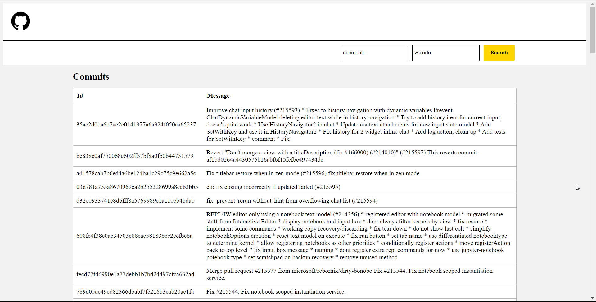
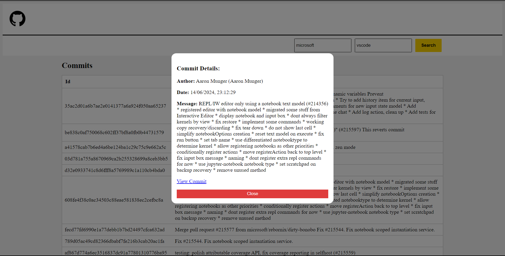

# Getting Started with The Github Commits Viewer App

## Programming Test

Objective:
Using React (and any other libraries you wish) and GitHub's API, implement a UI project that accomplishes the following:

Story:

- As an unauthenticated user, I want to see the last 100 commits in a GitHub repository of my choosing, with detailed information available upon clicking a single commit, so that I can understand the recent contributions to the repository.

## Acceptance Criteria:

Retrieve Commit Messages:

## Given: A GitHub owner and repository name.

- When: The user inputs the owner and repository name, and presses a button.
- Then: The application should return and display the commit messages of the last 100 commits for the specified repository.
  Display Commit Details:

## Given: A list displaying the 100 latest commits for the specified repository.

- When: The user clicks on a single commit message in the list.
- Then: The application should display the details of the commit, including the formatted date and time, author, and commit message.
  Handle Invalid Repository:

## Given: A GitHub owner or repository name that does not exist on GitHub.

- When: The user inputs the invalid owner or repository name, and presses a button.
- Then: The application should display an error message indicating that the owner or repository could not be found.

# Demo Images

## Available Scripts

In the project directory, you can run:

### `npm instal`

To install all the app's dependencies

### `npm run start`

Runs the app in the development mode.\
Open [http://localhost:3000](http://localhost:3000) to view it in the browser.

The page will reload if you make edits.\
You will also see any lint errors in the console.

### `npm run test`

Launches the test runner

### `npm run test:coverage`

To see the overall test coverage

### `npm run build`

Builds the app for production to the `build` folder.\
It correctly bundles React in production mode and optimizes the build for the best performance.
